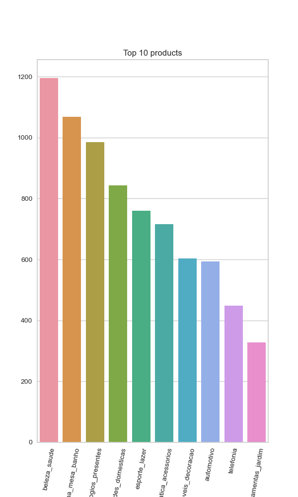
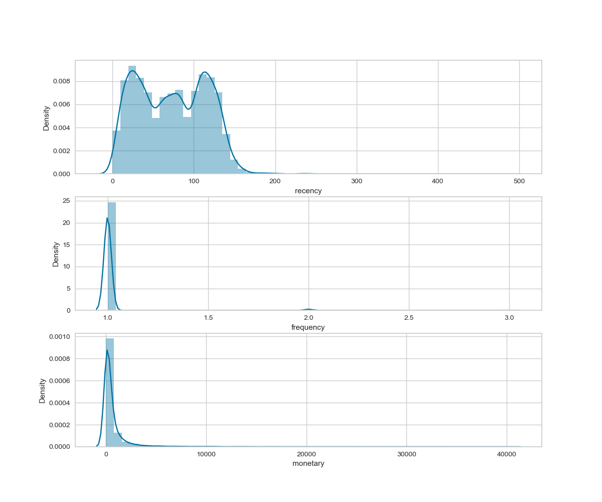
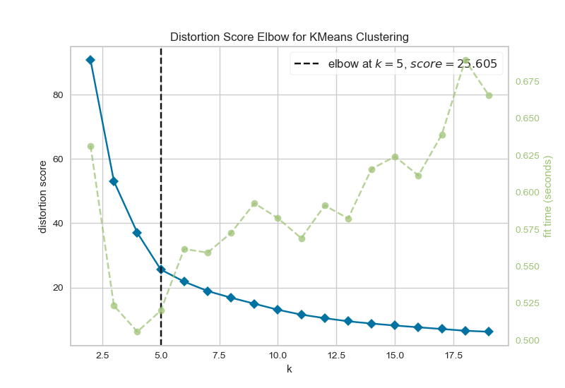

# RFM Analysis with Olist Dataset

### About Dataset

The dataset has information of 100k orders from 2016 to 2018 made at multiple marketplaces in Brazil. 
Its features allows viewing an order from multiple dimensions: 
from order status, price, payment and freight performance to customer location, 
product attributes and finally reviews written by customers. The schema of the dataset is as below.

Dataset Link: https://www.kaggle.com/datasets/olistbr/brazilian-ecommerce

* customers - This dataset has information about the customer and its location. Use it to identify unique customers in the orders dataset and to find the orders delivery location.
* geolocation - This dataset has information Brazilian zip codes and its lat/lng coordinates.
* order_items - This dataset includes data about the items purchased within each order.
* order_payments - This dataset includes data about the orders payment options.
* order_reviews - This dataset includes data about the reviews made by the customers.
* orders - This is the core dataset. Every necessary information is mapped to each order in this.
* products - This dataset includes data about the products sold by Olist.
* sellers - This dataset includes data about the sellers that fulfilled orders made at Olist.
* product_translation - This dataset includes the category names of products sold by Olist.

### Analysis
* Task 1: Gathering Data from DataBase and Data Understanding
* Task 2: Calculating RFM Metrics
* Task 3: Segmentation of Customers by RFM Metrics with K-Means
  * Step 1: Data Standardization
  * Step 2: Finding optimal number of clusters
  * Step 3: Building K-Means Model
  * Step 4: Looking at frequency of segments
  * Step 5: Statistical examination of each segment

### Results

